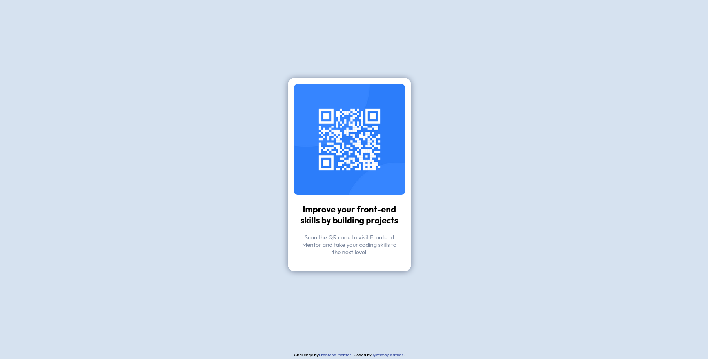

# Frontend Mentor - QR code component solution

This is a solution to the [QR code component challenge on Frontend Mentor](https://www.frontendmentor.io/challenges/qr-code-component-iux_sIO_H).

## Table of contents

- [Overview](#overview)
  - [Screenshot](#screenshot)
  - [Links](#links)
- [My process](#my-process)
  - [Built with](#built-with)
  - [What I learned](#what-i-learned)
  - [Continued development](#continued-development)
  - [Useful resources](#useful-resources)
- [Author](#author)
- [Acknowledgments](#acknowledgments)

## Overview

### Screenshot



### Links

- Solution URL: [Add solution URL here](https://your-solution-url.com)
- Live Site URL: [Add live site URL here](https://your-live-site-url.com)

## My process

### Built with

- Semantic HTML5 markup
- CSS custom properties
- Flexbox

### What I learned

This is the css design code snippet of the card of the qr-challenge. I had to do a little experiment with the box-shadow and border-radius.

```css
.card {
  max-width: 31.5rem;
  display: flex;
  flex-direction: column;
  gap: 2rem;
  padding: 1.6rem;
  box-shadow: 0 0.1rem 1.4rem hsl(220, 15%, 55%);
  border-radius: 1.8rem;
  background-color: hsl(0, 0%, 100%);
}
```

### Continued development

I still have a lot to improve in box-shadow and flexbox.
I have been reading a lot of articles from MDN and W3 school on this topics.

### Useful resources

- [MDN](https://developer.mozilla.org/en-US/) - This website helped me to any thing i had to look upon.
- [MDN flex-direction](https://developer.mozilla.org/en-US/docs/Web/CSS/flex-direction) - This is an amazing article which helped me finally understand flex-direction. I'd recommend it to anyone still learning this concept.

## Author

- Website - [Jyotimoy kathar](https://www.your-site.com)
- Frontend Mentor - [@Jyotimoykathar](https://www.frontendmentor.io/profile/Jyotimoykathar)

## Acknowledgments

Special Thanks to Frontend-metor for the mini-challenge to test and improve my coding skills and also improve writing my readme file.
